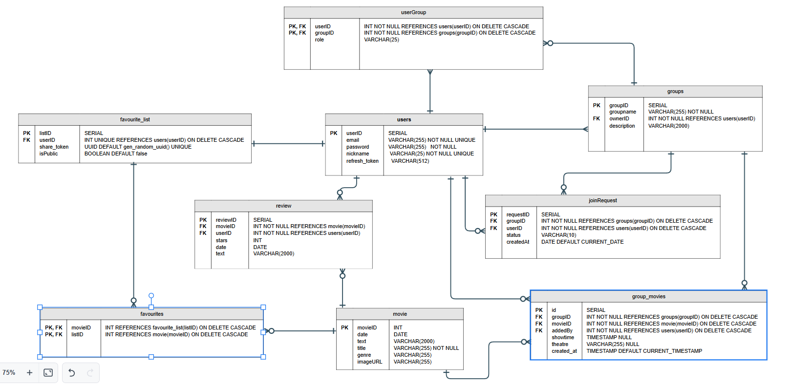

# Web application - USceneThis? 
#### *Group 17 (TVT24KMO)*

---

## Table of contents

- [*Project introduction*](#project-introduction)
- [*Project goals*](#project-goals)
- [*Usage instructions*](#usage-instructions)
- [*Documentation*](#documentation)
- [*Project outcome*](#project-outcome)
- [*Contributors*](#contributors)

---

## Project introduction

The aim of this project was ...


---

## Project goals

 :star: The purpose of this project was

 :star: The aim was to

 :star: 

---

## Usage instructions

### Developer setup

#### Database

You need a PostgreSQL database for this web application. We used [pgAdmin4](https://www.pgadmin.org/download/) as a graphical management tool for our PostgreSQL database.

You can initialize your database structure using the `db.sql` -file.

#### Open data APIs

This application utilizes two open data APIs, [TMBD](https://www.themoviedb.org/signup) and [Finnkino](https://www.finnkino.fi/xml/).

Finnkino doesn't need registration. To use TMDB, registration is required and after that you will be provided with your own API key. This key must be added to the `.env`. file in the projects´s root folder

#### Backend

For backend development, you should have Node.js installed (preferably version 22.18.0). You will also need a PostgreSQL server set up for this application. If you wish to run the application in the test mode, you will also need a separate test database.

You need to have two .env files, one under `server` folder and one under `root` folder.

Copy the file `server/.template.env` to `server/.env`and `/.template.env` to `/.env` and fill in your own environment variables.

**If you run the application locally**, please choose `DB_SSL = false`. Otherwise choose `DB_SSL = true`

**If you want to start the backend in test mode, run these commands in root folder:**

==NOTE: You will need test database for this==

```sh
cd server
npm install
npm run testStart
```

**For the backend in development mode, run these commands in the root folder:**

```sh
cd server
npm install
npm run devStart
```

**You can run REST API test on another terminal:**

```sh
cd server
npm run test
```

All 10 tests should pass if everything is set up correctly.

==NOTE: These tests initialize the database and all data stored in the database will be lost.==

#### Frontend

This is a React application.

**To start the frontend, run these commands in the root folder:**
```sh
npm install
npm run dev
```

---

### End user

*Deployment instructions coming soon*

## Documentation

### Deployment

???

---
### Database

For this project we created PostgreSQL database with pgAdmin 4.

**Class-diagram:**



**Design for our database:**
- Users
    - Columns: userID, email, password, nickname, refresh_token
    - Used for storing the registered user´s data
- Favourite_list
    - Columns: listID, userID, share_token, isPublic
    - Used for handling the favourite movies in one list
- Favourites
    - Columns: movieID, listID
    - Used to link a specific movie to a favourite list
- Review
    - Columns: reviewID, movieID, userID, stars, date, text
    - Used for storing movie reviews made by registerated users
- Movie
    - Columns: movieID, date, text, title, genre, imageURL
    - Used for storing data of a movie. Data is fetched from TMDB
- Groups
    - Columns: groupID, groupname, ownerID, description
    - Used for storing created groups
- UserGroup
    - Columns: userID, groupID, role
    - Used for linking user to a group and storing their role (owner, member) 
- JoinRequest
    - Columns: requestID, groupID, userID, status, createdAt
    - Used for storing join request to groups.
- Group_movies
    - Columns: id, groupID, movieID, addedBy, showtime, theatre, created_at
    - Used for storing and linking movies to a group page

---
### Frontend

**Logo:** ??

**Site map:**


---

### Project outcome

???

---

### Contributors

This project was constructed by four students: Miro Lampela, Samu Hintsala, Janina Niemelä and Satu Palviainen. 